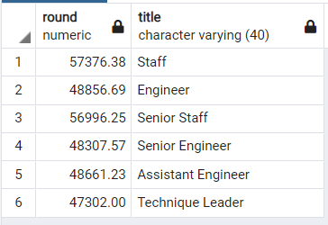

# Pewlett_Hackard_Analysis

## Overview
In this module, we are helping our fictional company prepare for their "Silver Tsunami", or big wave of folks reaching retirement age. In the module, we used SQL to filter the data of employees about to retire by their start and end dates, departments, salaries, and more. Now in this challenge, we were tasked with two findings. First, to determine the number of retiring employees per title, so that we know which type of employees are going to be needed the most. And second, to identify the employees who are eligible to participate in a mentorship program, so that as our retirees move out, they are replaced by well-trained mentees. Using PostgreSQL, we wrote statements to find this information.

## Results

1. A total of 43,636 engineering positions will need to be replaced.

2. A total of 40,497 staff employees to be replaced.

3. Only 2 management positions will need to be replaced.

4. The count of employees able to participate in a mentorship program (as mentors) is 1549 employees.

## Summary
A total of 90,398 employees will need to be replaced as this tsunami crashes. Of course this will happen gradually, and after viewing the data and our facts above, we can see that a majority of replacements will be Senior Engineering and Senior Staff positions. After using our next SQL query, we can see that our total number of mentors eligible to teach new employees is 1549. This of course, only includes employees born in the year 1965, which I believe vastly limits the number of potential mentors. I do not believe that, using the current metric for Eligible Mentors, we have enough of them to successfully support this transition in PH. We will need to expand the number of potential mentors to make any significant progress. 

An additional query I made was to check on the manager positions that need to be replaced. They are managers of the Sales and Research departments, both of which manage employees in the Staff and Senior Staff categories. This is cause for further concern when hiring for these positions, as we would be essentially rebuilding these departments from the ground up, and the mentorships in these departments would be more critical. This was found by querying all from the manager_info tables.

Another additional query that I wrote was to compare the salaries of all retiring employees. This information will be critical in hiring for the next generation of workers, in order to find a fair wage for the worker and to possibly save money on newer employees (who will be commensurated more as they become more experienced). I did this with the following statement:

    SELECT s.salary, e.emp_no, e.first_name, e.last_name, t.title
    INTO retiree_salaries
    FROM employees as e
    JOIN salaries as s
    ON e.emp_no = s.emp_no
    JOIN titles as t
    ON e.emp_no = t.emp_no
    WHERE (birth_date BETWEEN '1965-01-01' AND '1965-12-31')
    ORDER BY s.salary DESC;

I then took the average salary based on title using the following statement:

    SELECT ROUND(AVG(salary),2), title
    FROM retiree_salaries
    GROUP BY title
    ORDER BY COUNT(title) DESC;

The data shows that staff employees currently make more than the engineers on average. As we hire new employees, we can expect this average to decrease.

    

    
